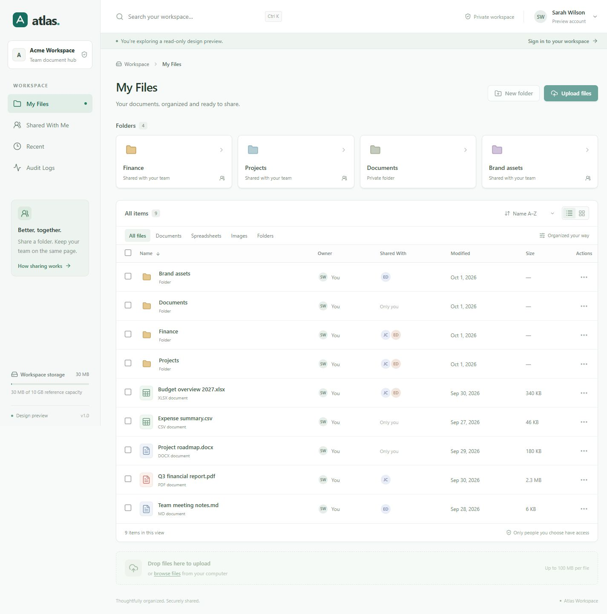
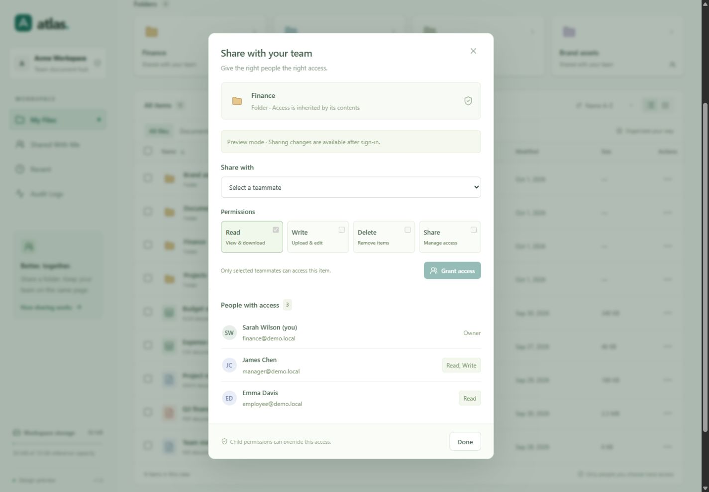

# Atlas — local document workspace

A small corporate document management demo with its own Atlas identity. React + TypeScript + Vite + Tailwind on the frontend; ASP.NET Core, EF Core, PostgreSQL, JWT, and MinIO on the backend. PostgreSQL stores metadata and hashed passwords. MinIO stores the actual file bytes under generated object keys.

TXT/LOG, JSON, XML, SQL, JS/TS, CSS/HTML, C# and Python open in CodeMirror 6 with syntax highlighting, permission-based editing and versioned saves. Markdown has rendered preview and source editing. The editor includes a compact responsive Find/Replace panel and JSON formatting. See [editor implementation, packages, changed files and tests](docs/code-editor.md). Uploads retain per-file progress, Cancel and Retry; see [upload implementation](docs/text-editor-uploads.md).

## Quick start

Install .NET 10 SDK, Node.js 22.12+ (Node 24 recommended), and Docker Desktop with Linux containers. Start Docker Desktop first. Commands below run from this repository unless a `cd` is shown. `cp` also works in PowerShell as a Copy-Item alias.

Copy the example configuration once:

```sh
cp infrastructure/.env.example infrastructure/.env
cp backend/appsettings.Local.example.json backend/appsettings.Local.json
cp frontend/.env.example frontend/.env.local
```

The supplied values are public local-demo credentials, not real secrets. Local configuration files are ignored by Git. If you change database or MinIO credentials in `infrastructure/.env`, update the matching values in `backend/appsettings.Local.json` too. Environment variables such as `ConnectionStrings__Database`, `Jwt__Key`, and `Minio__SecretKey` can override API settings. The JWT key must contain at least 32 bytes.

Start infrastructure:

```sh
cd infrastructure
docker compose config --quiet
docker compose up -d --build
docker compose ps
cd ..
```

Start the API in one terminal:

```sh
dotnet tool restore
dotnet restore backend
dotnet ef database update --project backend
dotnet run --project backend
```

The API also applies pending migrations on startup, initializes the MinIO bucket, and seeds a new database. Keep both infrastructure services running before starting it. On first startup, each user receives a personal My Files root, Documents, Projects, Reports, Brand assets, and three real sample text/CSV/Markdown files. Finance is intentionally not pre-created so the walkthrough below works as written.

Start the frontend in a second terminal:

```sh
cd frontend
npm install
npm run dev
```

Open [Atlas](http://localhost:5173). The API runs on [localhost:5050](http://localhost:5050/health), with [Swagger](http://localhost:5050/swagger) in Development. Log in through Swagger's `/api/auth/login`, copy the returned token, and use **Authorize** for protected endpoints.

| Service | Address |
| --- | --- |
| Frontend | http://localhost:5173 |
| API | http://localhost:5050/api |
| PostgreSQL | localhost:5433 |
| MinIO S3 | localhost:9000 |
| MinIO console | http://localhost:9001 |

Atlas uses host port 5433 for PostgreSQL to avoid conflicts with existing local PostgreSQL installations. Both infrastructure services bind to loopback and use persistent Docker volumes. MinIO is built locally from its pinned official source release (RELEASE.2025-04-22T22-12-26Z), because its published image registries rejected downloads. The first build takes a few minutes; subsequent starts reuse the image. MinIO console credentials come from `infrastructure/.env`.

## Demo accounts

All four accounts use **`Demo123!`**. Passwords are hashed with ASP.NET Core's PasswordHasher before storage. This password is also configurable through `Demo:Password` before initial seeding.

| Account | Display name | Role |
| --- | --- | --- |
| admin@demo.local | Alex Morgan | Admin |
| finance@demo.local | Sarah Wilson | Employee |
| manager@demo.local | James Chen | Manager |
| employee@demo.local | Emma Davis | Employee |

Sign out through the avatar menu. JWTs are stored in sessionStorage and expire after eight hours by default. A 401 clears the local session. Signing out clears the token in the frontend; there is no server-side revocation or refresh-token system in this MVP.

## Interface

- My Files, Favorites, Shared With Me, Shared by me, Recent, and Audit Logs in a responsive sidebar. Favorites are personal and persist in PostgreSQL; use an item's three-dot menu to add/remove one. Shared by me lists owned files/folders with active direct sharing. READ checks apply to both views, and opening a folder shows its contents normally.
- Workspace capacity displays used bytes without a fixed quota or a percentage bar. See [Favorites and outgoing shares](docs/favorites.md).
- Workspace search (`Ctrl/Cmd + K`), breadcrumbs, folder shortcuts, file-type filters, sorting, list/grid views, and selection.
- Name, Owner, Shared With, Modified, Size, and Actions columns. Mobile tables scroll within their panel.
- Folder/file icons, permission badges, teammate avatars, and a three-dot context menu.
- Upload picker and drag-and-drop uploads, nested folders, download, rename, move, and permanent delete with confirmation.
- Share modal with READ / WRITE / DELETE / SHARE, current access, inheritance source, permission updates, and removal of direct grants.
- Loading, empty, offline, validation, and success states. Read-only access disables mutation controls.

For a frontend-only visual review, use **Explore the interface** on the login screen or [design preview](http://localhost:5173/?preview=1). This mode uses illustrative browser-side data, clearly labels itself, and disables changes and real downloads. It does not authenticate or substitute for the PostgreSQL/MinIO application.





## Permission model

Permission checks live in `backend/Permissions/PermissionService.cs`. Every operation goes through the domain service; hiding a frontend button is not the authorization boundary.

| Bit | Permission | Behavior |
| --- | --- | --- |
| 1 | READ | Browse folders, view metadata and access lists, download files |
| 2 | WRITE | Upload, create folders, rename, edit supported text/code and Office content; owners can also move items |
| 4 | DELETE | Permanently delete files/folders |
| 8 | SHARE | Set or remove another user's direct permission |

Grants are numeric bitmasks in the API; READ + WRITE is `3`. Except for an explicit `0` denial, all grants include READ. Owners have all permissions (`15`). Admin can inspect all audit events, but does **not** bypass resource permissions: the demo still requires Finance to share Secret.xlsx with Admin.

For a file, a direct file grant takes priority. Otherwise the closest explicit folder grant applies, walking toward the root. A more specific grant **replaces**, rather than adds to, inherited permissions. Explicit zero permissions block inherited access. Removing a direct grant restores parent inheritance, which can mean access remains; inherited access can be changed at its source or overridden on the child.

Shared With Me displays the highest accessible directly shared items. Subfolders and files under a readable shared folder appear when opening that folder. A separately shared child under an inaccessible ancestor appears directly. Breadcrumbs omit ancestors the recipient cannot read.

Uploads and new folders in a shared workspace retain the parent owner's identity and inherit that folder's permissions. The audit log records the actual actor. Moving is limited to the owner within their own workspace, rejects cycles, and may change inherited access; direct grants remain attached. Recursive deletion checks every descendant before deleting anything so a child override cannot be bypassed. A user with SHARE can only delegate permissions they have, and cannot modify their own or the owner's access.

## Requested walkthrough

1. Sign in as **finance@demo.local**.
2. In My Files choose **New folder**, name it **Finance**, and open it.
3. Create **Budget** inside Finance, then open Budget.
4. Upload `scripts/fixtures/Budget_2027.xlsx` (included, a valid small spreadsheet), or your own spreadsheet.
5. Return to Finance's parent through breadcrumbs. Open Finance's three-dot menu → **Share & manage access**.
6. Select James Chen (`manager@demo.local`), leave only **Read** checked, and choose **Grant access**.
7. Sign out, then sign in as **manager@demo.local**.
8. Open **Shared With Me → Finance → Budget**. Budget_2027.xlsx is visible and downloadable. Upload, rename, and delete are disabled; direct API attempts also return 403.
9. Sign out and return as Finance. Open Finance's Share modal, select James Chen or click his access badge, enable **Read + Write**, and choose **Update access**.
10. Sign in again as Manager. Upload another file inside Finance or Budget. DELETE and SHARE remain unavailable.
11. Open **Audit Logs** to inspect create, upload, download, sharing, permission-change, and login events. Admin can inspect all events; other users see their own activity plus events on currently readable resources.

An automated version runs against the real running API and services with PowerShell 7:

```powershell
pwsh -File scripts/Test-Demo.ps1
```

It creates a uniquely named Finance demo folder, uploads the included workbook, checks READ inheritance and forbidden mutations, changes access to READ + WRITE, uploads as Manager, and verifies audit events. It preserves the test documents for inspection, and can be rerun without name conflicts.

## Structure and API

```text
frontend/          React UI, API client, preview, component styles
backend/
  Auth/            Current authenticated user
  Controllers/     Authentication and resource routes
  Data/            EF context, initial migration, seed, design-time factory
  DTOs/            Validated requests and response contracts
  Entities/        Users, roles, folders, files, permissions, audit events
  Permissions/     Central inheritance and authorization
  Services/        Document operations and audit recording
  Storage/         MinIO binary storage
backend.Tests/     Permission and service regression tests
infrastructure/    Docker Compose and example environment
scripts/           Full demo smoke test and spreadsheet fixture
```

The EF context is the data access layer; no extra repository abstractions are needed for this demo. The initial migration creates the seven requested tables, foreign keys, and indexes (including unique user email, object key, grant recipient/resource pairs, and sibling resource names).

| Method | Route | Purpose |
| --- | --- | --- |
| POST | /api/auth/login | JWT login |
| GET | /api/auth/me, /api/auth/users | Current user / demo teammates |
| GET | /api/explorer?view=files\|shared\|recent&folderId=…&search=… | Permission-filtered explorer |
| POST | /api/folders | Create folder with `name` and `parentFolderId` |
| POST | /api/files/upload | Multipart `parentFolderId` and `file` |
| GET | /api/files/{id}/download | Download binary |
| PATCH | /api/resources/{folder\|file}/{id}/name | Rename with `name` |
| PATCH | /api/resources/{folder\|file}/{id}/move | Move with `parentFolderId` |
| DELETE | /api/resources/{folder\|file}/{id} | Delete |
| GET, PUT | /api/resources/{folder\|file}/{id}/shares | Read / set access (`userId`, `permissions`) |
| DELETE | /api/resources/{folder\|file}/{id}/shares/{userId} | Remove direct grant |
| GET | /api/stats, /api/audit | Storage metadata / audit events |

## Verification

```sh
dotnet build backend
dotnet test backend.Tests
dotnet ef migrations has-pending-model-changes --project backend
cd frontend
npm test
npm run build
cd ../infrastructure
docker compose config --quiet
```

The backend tests use isolated in-memory SQLite databases to verify inheritance, overrides, ownership, read-only denial, WRITE upgrades, delegation limits, shared-view navigation, duplicate names, and move-cycle prevention. The production backend always uses PostgreSQL; SQLite is only a test dependency.

Verified: frontend and backend builds, 80 backend tests, 71 frontend tests, migration/model consistency, Compose configuration, desktop/mobile browser checks, actual PostgreSQL migration and seeding, and the full PostgreSQL/MinIO smoke test. Expanded code editing has 55 live HTTP checks; preview streaming/access controls have 22, text editing/upload cancellation 19, and ONLYOFFICE 16. Browser sign-in from 127.0.0.1 is verified. Docker Desktop is installed under the user profile; start its engine before starting the infrastructure. PostgreSQL uses host port 5433 to avoid the existing local service on 5432.

## MVP boundaries and troubleshooting

- Local demo only: no production identity provider, server-side logout revocation, public links, recovery/trash, antivirus scanning, or enforced storage quota. Office saves have immutable version snapshots; restoring a version and the ONLYOFFICE history panel are not implemented. The sidebar shows actual usage without a capacity limit.
- Maximum 100 MB per file. Downloads buffer the file in memory. Empty files are allowed. Upload failures are shown individually; successful files in a multi-file upload are retained.
- Deletion removes metadata transactionally before removing objects. If MinIO is unavailable during cleanup, unused objects can remain; the API logs the object key. PostgreSQL and MinIO do not share a transaction. A crash during initial seed can similarly leave unused seed objects.
- The explorer favors a simple permission-filtered implementation over large-scale query optimization. Recent returns up to 30 modified readable files. Audit displays up to 200 accessible events from the latest 500 events; events on deleted resources are visible to their actor and Admin.
- Concurrent rename/move/share operations are not versioned. Same-kind name collisions are constrained in the database; simultaneous cross-kind file/folder name collisions are not covered by a shared database constraint.
- If sign-in says the API is unreachable, check the API terminal and start infrastructure. If startup cannot connect, inspect `docker compose ps` and the credentials in both configuration files. If ports are occupied, adjust Compose, API launchSettings, `VITE_API_URL`, and `FrontendOrigin` consistently. Changing PostgreSQL credentials after its volume is initialized does not automatically update the stored account.
- Docker volumes persist after `docker compose down`. Avoid removing volumes if you want to keep uploaded documents and permissions.

The frontend has its own logo and styles and contains no Nextcloud assets or branding. Icons are from Lucide.

## ONLYOFFICE Docs

DOCX, XLSX, and PPTX now open in the browser with signed permission-based view/edit configurations and collaborative save-back to versioned MinIO objects. Start the integration with `./scripts/Start-OnlyOfficeDemo.ps1` in PowerShell 7, then run the frontend normally. See [the ONLYOFFICE guide](docs/onlyoffice.md) for environment variables, endpoints, permission mapping, callback/versioning behavior, and local tests. Existing documents and shared-folder permissions are preserved by the migration.

## File previews

File names open an in-app preview in both list and grid views. Images, videos, PDF and CSV use their dedicated viewers; supported text/code uses CodeMirror, Markdown adds rendered preview, and Office documents retain ONLYOFFICE. Unsupported formats show metadata and an explicit Download action. READ checks apply to each inline/range request and MinIO remains private. See [the preview guide](docs/file-preview.md) for endpoints, security, demo limits, changed files and test instructions.

