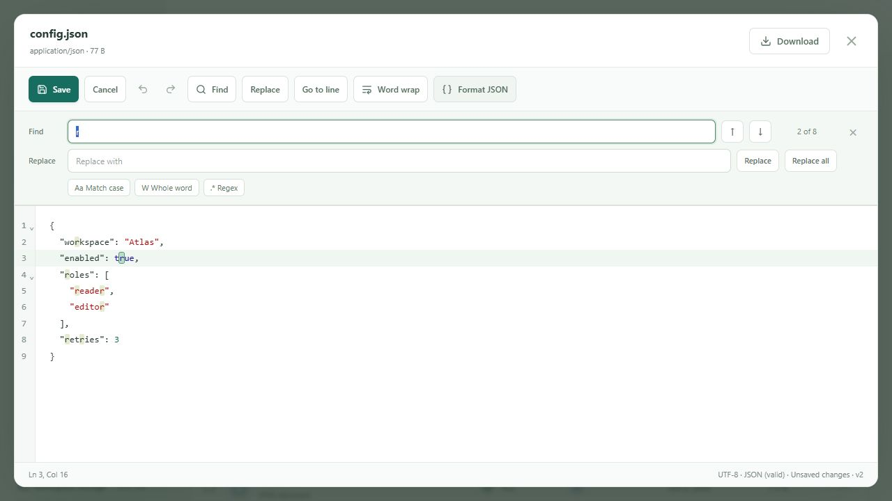
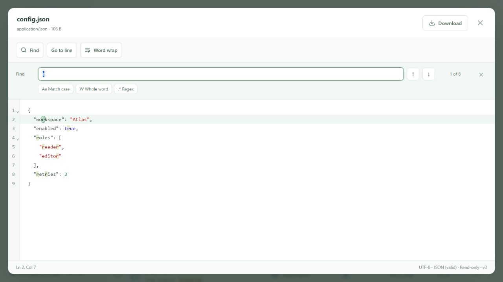
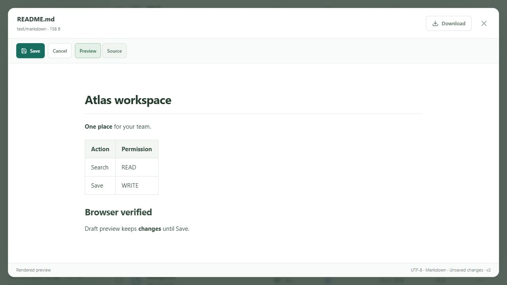
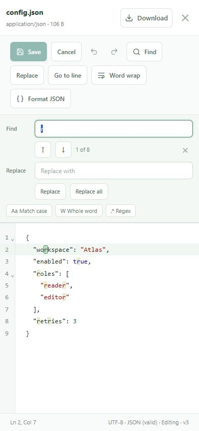

# Text and code editor

File clicks open one reusable CodeMirror 6 preview. READ users can select, copy, search, navigate to a line and change word wrap. READ + WRITE users initially see the same read-only preview, then choose Edit to enable Save/Cancel, undo/redo and replacement. Downloads remain explicit. Markdown starts with the safe react-markdown renderer; Edit opens its CodeMirror source, and Preview/Source switches preserve the draft and undo history. Save is available from either Markdown view while editing.

## Shared type registry and languages

`shared/text-file-types.json` is the single extension/language/MIME registry consumed by frontend `textFileTypes.ts` and backend `TextFileTypes.cs`. The backend project copies it to build and publish output. Matching ignores extension case. Missing/generic binary/plain-text MIME and known per-language aliases select the registered language; a contradictory binary MIME keeps its existing viewer classification. The normalized API content type does not alter the file's stored MIME metadata.

| Extensions | Language | Canonical MIME |
| --- | --- | --- |
| txt, log | Plain Text | text/plain |
| json | JSON | application/json |
| xml | XML | application/xml |
| md, markdown | Markdown | text/markdown |
| sql | SQL | application/sql |
| js | JavaScript | text/javascript |
| ts | TypeScript | text/typescript |
| css | CSS | text/css |
| html | HTML | text/html |
| cs | C# | text/x-csharp |
| py | Python | text/x-python |

`editorLanguages.ts` lazily loads and caches each language extension. JavaScript and TypeScript use the same grammar with the TypeScript option. C# uses CodeMirror's supported legacy stream parser. TXT/LOG use plain text, without JavaScript highlighting or automatic bracket insertion. The basic editor setup provides line numbers, active-line and selection highlighting, bracket matching/closing, indentation, history and selection shortcuts. The toolbar provides undo/redo, go-to-line and word wrap; the status bar shows line/column, encoding, language, edit state and version.

JSON adds the JSON grammar/linter and an immediate validation message. Format JSON uses JSON.parse/JSON.stringify with two-space indentation and retains the document's line-ending convention. The formatting change is undoable. Invalid input is left intact and reports its parse error. Validation is advisory: users can save an intentionally incomplete JSON draft.

New direct dependencies, all CodeMirror 6:

- `@codemirror/lang-json` 6.0.2
- `@codemirror/lang-xml` 6.1.0
- `@codemirror/lang-sql` 6.10.0
- `@codemirror/lang-javascript` 6.2.5
- `@codemirror/lang-css` 6.3.1
- `@codemirror/lang-html` 6.4.12
- `@codemirror/lang-python` 6.2.1
- `@codemirror/lang-markdown` 6.5.2
- `@codemirror/legacy-modes` 6.5.4
- `@codemirror/language` 6.12.4
- `@codemirror/lint` 6.9.7

The existing CodeMirror core, react-markdown and remark-gfm dependencies are reused. The lockfile records installed versions. Vite pre-optimizes the language packages for development so first use does not reload an open editor.

## Search panel

`editorSearch.ts` supplies `search({ top: true, createPanel })`. It replaces the default panel DOM, while CodeMirror's SearchQuery, native cursor, findNext/findPrevious, replacement commands and match decorations remain responsible for search behavior. The compact panel has a dominant Find input, previous/next arrows, current/total count, close button and small Match case/Whole word/Regex toggle buttons. Replace and Replace all occupy a second row only in edit mode. Read-only state also disables the native replacement commands. Accessible labels, pressed states, a live count, keyboard focus/hover states and invalid-regex feedback are included.

`editorSearch.css` scopes application colors, typography, rounded inputs, spacing and current/all-match highlighting. At 600 px and below, inputs retain a readable width and buttons wrap onto orderly rows. The panel is inside the editor above the content rather than overlaying it. Match counting uses the native query cursor, caches by document/query and stops at 10,000, displaying `10,000+ matches` beyond that limit.

| Shortcut | Action |
| --- | --- |
| Ctrl/Cmd+F | Find, including when focus is in the preview header |
| Ctrl/Cmd+H | Replace in edit mode; Find for read-only previews |
| Enter / Shift+Enter in search | Next / previous match |
| Escape in search | Close search while retaining the file preview |
| Ctrl/Cmd+G | Go to line |
| Ctrl/Cmd+Z / Ctrl+Y or Cmd+Shift+Z | Undo / redo |









## Backend save and security

The existing endpoints remain: `POST /api/files/{id}/preview`, `GET/HEAD /api/files/{id}/content`, and `PUT /api/files/{id}/content`. No additional endpoint, environment variable or migration is needed.

PUT accepts `{ "content": "...", "expectedVersion": 2 }` and returns a fresh preview ticket. `TextContentService` checks current READ + WRITE through the existing permission service, including shared-folder inheritance, child overrides and explicit denies. The supported extension/MIME registry, UTF-8 validation, null-byte restriction, 512 KiB byte limit, document lock and version-conflict checks apply server-side.

The existing `FileVersionService.Replace` writes a private MinIO object and advances the existing file's pointer/version/size/timestamp. Its original identity, owner, folder, MIME, creation time and grants remain intact. Earlier objects stay as immutable versions. The database transaction also records EDIT_FILE and SAVE_FILE_VERSION audit events. Save failure keeps the previous content and removes the newly created object when possible. A stale edit returns 409; READ-only requests return 403. Preview tokens cannot authorize saves.

The editor tracks differences from the loaded source. Close and Cancel confirm only for dirty drafts; refusing the dialog preserves changes. Browser navigation/reload gets a beforeunload warning. The modal keeps the background explorer inert, so file switching/navigation requires closing the current preview. Save/Cancel/Close are protected while a save is pending. Failed saves retain the draft.

HTML/XML/JavaScript/SQL/Python/C# are source documents only; the application never executes them or injects uploaded markup into its DOM. Markdown retains raw-HTML suppression, safe links and external-image labels. Existing inline responses retain sandbox CSP/nosniff headers. MinIO URLs/object keys stay private. Image, Video.js, PDF.js, CSV and ONLYOFFICE previews retain their existing paths.

## Run and verify

Start Docker Desktop, then run from the project root in PowerShell 7:

```powershell
./scripts/Start-OnlyOfficeDemo.ps1
```

In another terminal:

```powershell
cd frontend
npm install
npm run dev
```

Open http://127.0.0.1:5173. Finance (`finance@demo.local`, `Demo123!`) can edit its documents. Generate retained fixtures and a folder shared READ with Manager:

```powershell
./scripts/Test-CodeEditor.ps1
```

The latest run created **Code editor demo 20261002-143916**, with supported text/code fixtures plus invalid JSON, UTF-16 Python and unsupported RTF. IDs and check count are recorded in ignored `.cache/code-editor-live.json`. Sign in as Finance, open that folder and test Edit, JSON Format, Ctrl+F/H, match navigation, Replace, undo/redo, go-to-line and wrap. Open README.md, edit the source, switch to Preview and Save. Try closing/cancelling a dirty draft. Sign in as Manager and open Shared With Me → the same folder to verify read-only behavior. Audit Logs and the existing versions endpoint show successful saves.

```powershell
dotnet build backend
dotnet test backend.Tests
cd frontend
npm test
npm run build
cd ..
./scripts/Test-CodeEditor.ps1
./scripts/Test-TextUploads.ps1
./scripts/Test-FilePreview.ps1 -FixtureDirectory "$PWD/.cache/preview-fixtures"
./scripts/Test-OnlyOffice.ps1 -OfficeFixtureDirectory "$PWD/.cache/office-fixtures"
```

Verified locally: frontend production build and backend build; **77 backend tests**, **71 frontend tests**, **55 new live editor checks**, **19 text/upload checks**, **22 preview checks** and **16 ONLYOFFICE checks** against the running PostgreSQL/MinIO/API. Browser checks confirmed JSON formatting/save to version 3, invalid formatting without content loss, `2 of 8` search navigation, Escape closing only search, Markdown default rendering/source/draft preview/save to version 3, READ-only Ctrl+H and a 390 × 844 responsive panel. Component tests also verify declining dirty Close/Cancel, draft retention, beforeunload, permission-based replacement suppression and preserving MIME-only Markdown preview without enabling saves for unregistered extensions.

Limits: editable UTF-8 documents are capped at 512 KiB; larger documents are truncated read-only previews with Download, and UTF-16 remains read-only. C# is syntax highlighting through a stream parser, SQL uses the default dialect, and JSON validation is syntax-only. There is no compilation, execution, completion service or real-time CodeMirror collaboration; text saves use optimistic version conflicts. Existing ONLYOFFICE collaboration remains available for DOCX/XLSX/PPTX. The production build retains the existing Video.js chunk-size warning; the backend environment cannot reach NuGet's vulnerability feed (NU1900), while compilation/tests succeed.

## Files changed for this task

- Shared: `shared/text-file-types.json`.
- Backend: `backend/backend.csproj`, `backend/Services/TextFileTypes.cs`, `backend/Services/FileContentService.cs`, `backend/Services/TextContentService.cs`, `backend.Tests/TextAndUploadTests.cs`.
- Frontend editor: `frontend/src/features/file-preview/textFileTypes.ts`, `editorLanguages.ts`, `jsonTools.ts`, `editorSearch.ts`, `editorSearch.css`, `TextPreview.tsx`, `MarkdownPreview.tsx`, `FilePreview.tsx`, `PreviewModal.tsx`, `previewResolver.ts`, `preview.css`.
- Frontend tests: `frontend/src/features/file-preview/textFileTypes.test.ts`, `editorSearch.test.ts`, `editorFlow.test.tsx`.
- Dependencies/configuration: `frontend/package.json`, `frontend/package-lock.json`, `frontend/vite.config.ts`.
- Demo/docs: `scripts/Test-CodeEditor.ps1`, `scripts/Test-TextUploads.ps1`, `README.md`, `docs/file-preview.md`, `docs/text-editor-uploads.md`, this guide and four `docs/code-editor-*.png` screenshots.
