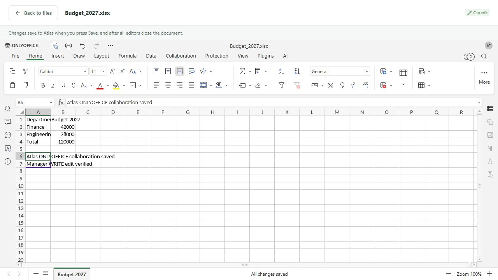

# ONLYOFFICE Docs demo

Atlas integrates directly with the ONLYOFFICE Docs API. Authentication remains Atlas JWT, users remain the existing users, all access decisions use `PermissionService`, and binaries remain in the existing MinIO bucket. The explorer and sharing dialogs are unchanged apart from opening DOCX/XLSX/PPTX in an editor overlay. Download remains available in the action menu.

The original repository had no content versioning. `FileVersionService` now stores immutable snapshots and advances `Document.Version` on saves. The migration backfills every existing file as version 1 without copying or replacing its object. Initial uploads and seeds also register version 1. Names, original names, owner, folder, created time, and shares remain attached to the original file ID. New saves change only its current object, size, modified time, and content version. Deleting a file also removes its version objects through the existing deletion service.

## Run locally

Start Docker Desktop with Linux containers. Keep the existing local database/MinIO config. Stop the previous API terminal so port 5050 is available. From the repository root, in **PowerShell 7**:

```powershell
./scripts/Start-OnlyOfficeDemo.ps1
```

The script creates/imports the ignored `infrastructure/.env`, generates a cryptographically random JWT secret if absent, starts Compose's `office` profile, imports ONLYOFFICE environment variables into the API process, and runs the API. The API applies the version migration. The official Document Server image is pinned to `onlyoffice/documentserver:9.4.0.1`. Its initial download is large; allow a few minutes for startup. `http://localhost:8082/healthcheck` must return `true`.

In a second terminal:

```powershell
cd frontend
npm run dev
```

Open http://localhost:5173 and sign in as `finance@demo.local`, password `Demo123!`. Upload a DOCX, XLSX, or PPTX, then click its name or **Open in ONLYOFFICE** in the three-dot menu. Other formats retain the existing download flow.

For manual startup, set all variables below in the API terminal, use the same JWT secret as Compose, and run:

```powershell
docker compose --project-directory infrastructure --profile office up -d --build
dotnet run --project backend --no-launch-profile --urls http://0.0.0.0:5050
```

The API must listen on a host interface reachable by the container. `localhost` inside Docker refers to Document Server, so the backend advertises its callback/content URLs using `host.docker.internal`. The browser and API use the host-mapped Document Server port. The editor script URL comes from the backend configuration; no frontend secret or Document Server URL is required.

## Environment

These variables are documented in `infrastructure/.env.example`. Non-secret settings also appear in `backend/appsettings.Local.example.json`. The secret is read **only from the API process environment**, never from JSON, and is independent of Atlas's authentication signing key.

| Variable | Local example | Purpose |
| --- | --- | --- |
| `OnlyOffice__JwtSecret` | Empty in the example; generated by the start script | Shared HS256 signing secret, at least 32 bytes; Compose maps it to `JWT_SECRET` |
| `OnlyOffice__DocumentServerUrl` | `http://localhost:8082` | Browser-facing Docs URL |
| `OnlyOffice__InternalUrl` | `http://localhost:8082` | API-facing Docs health/download URL |
| `OnlyOffice__ApiUrl` | `http://host.docker.internal:5050` | Atlas origin reachable from Docs; do not append `/api` |
| `OnlyOffice__SessionHours` | `24` | Maximum editing-session and scoped-token lifetime, 1–168 hours |
| `ONLYOFFICE_PORT` | `8082` | Docker host port; update both Docs URL variables when changing it |

Compose keeps `JWT_ENABLED=true` and `JWT_IN_BODY=true`. `ALLOW_PRIVATE_IP_ADDRESS=true` lets the local container reach the host API. Document Server remains bound to host loopback. All URLs are configured, including the distinct browser/server addresses. Use matching HTTPS origins if adapting this demo outside localhost.

## Endpoints and permissions

| Endpoint | Authorization and behavior |
| --- | --- |
| `GET /api/onlyoffice/files/{id}/config?mode=auto` | Atlas JWT + READ. Backend chooses edit/view and signs the complete config. `mode=view` may request a viewer; `mode=edit` additionally requires WRITE and returns 403 otherwise. |
| `GET /api/onlyoffice/files/{id}/content?access_token=…` | A signed, expiring, file/user/session/version-scoped token; rechecks current READ access and retrieves the session's immutable initial version through `FileVersionService`. No raw object path is exposed. |
| `POST /api/onlyoffice/files/{id}/callback?access_token=…` | A callback-scoped token plus the signed Docs callback, accepted in body or `Authorization: Bearer` header. Atlas user tokens/config tokens cannot substitute for callback signatures. |
| `GET /api/files/{id}/versions` | Atlas JWT + current READ; lists snapshot metadata without exposing object keys. |
| `GET /api/files/{id}/versions/{number}/download` | Atlas JWT + current READ; retrieves the requested snapshot. |

| Atlas access | ONLYOFFICE mode/permissions |
| --- | --- |
| No READ, including an explicit deny | 403; no editor config or document bytes |
| READ | `mode=view`, `edit=false`, `download=true`, `print=true`; comment/review/form editing disabled |
| READ + WRITE | `mode=edit`, `edit=true`, with editing/comment/review/form actions enabled; download/print remain enabled |
| DELETE / SHARE | Continue to control Atlas delete/share actions; do not grant editor access |

ONLYOFFICE has no separate `permissions.view` parameter. Viewing is enforced by Atlas's READ check and `editorConfig.mode`; edit is independently signed in `document.permissions.edit`. Folder inheritance, nearest overrides, explicit zero grants, and owner access all use the existing permission resolver. Admin receives no resource bypass. A user cannot promote a signed viewer config by editing its frontend fields. See the official [permission API](https://api.onlyoffice.com/docs/docs-api/usage-api/config/document/permissions/) and [configuration signatures](https://api.onlyoffice.com/docs/docs-api/additional-api/signature/browser/).

## Callback, saving, and collaboration

Each authorized open joins a persistent session for that file. Collaborators use the same key, derived from file ID and initial content version with a session suffix, and their existing Atlas user IDs/names. Changing metadata or shares does not change the document content key.

For a save, the backend validates both the callback capability and Docs JWT. It uses only signed callback fields, matches the session key, and checks that every reported editor was issued an editing config and still has READ + WRITE. A revoked grant, explicit deny, or read-only participant cannot save. The signed save URL must use a configured Docs origin and `/cache/files/`; downloads route through the configured internal origin with redirects disabled and a 100 MB limit. The returned OOXML container is checked before storage.

Status `6` (force-save/Save button) and `2` (final save) retrieve the edited binary using `OnlyOfficeClient`. `FileVersionService` writes a new generated MinIO object and creates a snapshot. PostgreSQL commits the current file pointer, version, session state, and `SAVE_FILE_VERSION` audit record together. The old object remains available as a prior version. Retries of the same signed save callback are idempotent. If storage or the database fails, the previous stored version remains current and the callback returns `error=1`; a newly written object is cleaned up on DB failure.

Successful callbacks return `{"error":0}` only after persistence. Status `1` acknowledges editing; `4` closes without changes; `3`/`7` report failures. A force-save advances the stored snapshot while retaining the active collaboration key. The session's last saved version prevents stale writes. After the final save closes the session, reopening uses the latest content version and a new key. This follows ONLYOFFICE's requirement to [retain a key during force-save and change it after final save](https://api.onlyoffice.com/docs/docs-api/get-started/how-it-works/co-editing/).

## Test the demo

```powershell
dotnet test backend.Tests
cd frontend
npm test
npm run build
cd ..
./scripts/Test-OnlyOffice.ps1
```

The smoke test creates a unique folder and workbook, verifies owner edit/inherited read modes, signed configs, shared keys, forbidden edit/unshared access, scoped retrieval, invalid JWT rejection, missing/unsupported files, initial versions, and upgrading to WRITE. It preserves the folder for browser testing. Optional `-OfficeFixtureDirectory <directory>` also uploads DOCX/PPTX samples.

1. Sign in as Finance, locate the new **ONLYOFFICE demo → Budget → Budget_2027.xlsx**, and open it.
2. Sign in as Manager in a second browser session/tab. Open the same shared workbook; both can edit after the smoke test's WRITE upgrade.
3. Edit a cell and verify the second editor sees it. Click Save and inspect `GET /api/files/{id}/versions` and the `SAVE_FILE_VERSION` audit entry.
4. Close both editors. Allow roughly 10 seconds for Docs' final callback. Reopen the workbook; verify the content persisted and the config key changed.
5. Set Manager's folder grant to READ using the existing Share dialog. Reopen as Manager; the editor must display read-only mode. A direct config request with `mode=edit` returns 403.
6. Stop the ONLYOFFICE container temporarily; opening a supported file shows an availability error with a retry action.

Backend regression tests also cover explicit denies, forged callbacks/config-token replay, unsigned body tampering, unauthorized save authors, revoked WRITE access, download URL restrictions, duplicate callbacks, closed sessions, immutable history, unchanged metadata, unavailable servers, corrupt downloads, and failed storage writes.

Verified locally: 36 backend tests and 14 frontend tests, both builds, migration/model consistency, healthy Docker services, and the live API smoke test. Browser testing opened DOCX/PPTX viewers, confirmed two-user spreadsheet collaboration, saved as the shared-folder WRITE user, and verified force-save version 2, final-save version 3, both users' persisted cells, original-version download, audit actor, and document-key rotation. The demo folder `ONLYOFFICE demo 20261001-144404` is retained for inspection.



## Files changed

| Area | Files |
| --- | --- |
| Backend integration | `backend/Controllers/OnlyOfficeController.cs`, `backend/DTOs/OnlyOfficeContracts.cs`, `backend/Services/OnlyOfficeService.cs`, `OnlyOfficeClient.cs`, `OnlyOfficeTokens.cs`, `OnlyOfficeOptions.cs`, `DocumentLocks.cs`, `FileVersionService.cs`, `backend/Program.cs` |
| Existing storage/file paths | `backend/Services/DocumentService.cs`, `backend/Storage/ObjectStorage.cs`, `backend/Data/SeedData.cs` |
| Persistence | `backend/Entities/Models.cs`, `backend/Data/AppDbContext.cs`, `backend/Data/Migrations/20261001102918_OfficeVersions.cs`, its `.Designer.cs`, and `AppDbContextModelSnapshot.cs` |
| Frontend | `frontend/src/components/OfficeEditor.tsx`, `frontend/src/onlyoffice.ts`, `frontend/src/App.tsx`, `frontend/src/styles.css` |
| Local infrastructure/config | `infrastructure/docker-compose.yml`, `infrastructure/.env.example`, `backend/appsettings.Local.example.json` |
| Scripts/tests | `scripts/Start-OnlyOfficeDemo.ps1`, `scripts/Test-OnlyOffice.ps1`, `backend.Tests/OnlyOfficeTests.cs`, `frontend/src/onlyoffice.test.ts` |
| Documentation | `README.md`, `docs/onlyoffice.md`, `docs/onlyoffice-edit.png`, `docs/onlyoffice-view.png`, `docs/onlyoffice-saved.png` |

## Demo limits and troubleshooting

- Run one Atlas API process. The demo serializes editor config/saves per file in that process and uses EF content-version concurrency checks. Multiple API replicas would need a database/distributed lock and shared callback idempotency coordination.
- An editor session expires after the configured lifetime. Reopen after expiry; this demo does not implement proactive Docs disconnection on permission changes. Backend content/save requests revalidate current permissions, but content already loaded in an editor cannot be recalled.
- Keep Docs, MinIO, and PostgreSQL running until pending saves finish. Close editors before restarting the API/Docs. The API and MinIO do not share a transaction; a process crash at the storage-write/DB boundary can leave an unused object.
- The version listing/download API is included; restoring versions, displaying ONLYOFFICE's own history/changes panel, and retention cleanup are outside this demo.
- For document download failures, check `OnlyOffice__ApiUrl`, API host binding, and Docker's `host.docker.internal` reachability. For save failures, inspect Atlas callback warnings and Docs logs. Never paste JWT secrets or scoped URLs into shared logs.
- A JWT error usually means the API and container have different secrets. Update the ignored env file, recreate the Docs container, and restart the API using the start script. Do not disable JWT to work around it.
