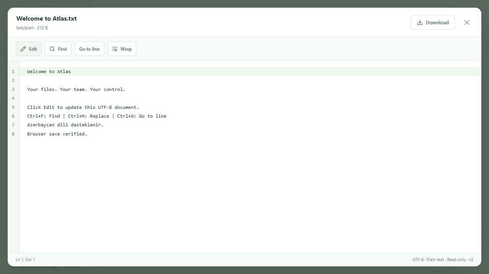

# Text editor and upload progress

Text and code filenames open CodeMirror 6 in read-only mode; Markdown starts rendered and supports source editing. Language support, JSON formatting and the redesigned search panel are detailed in [Text and code editor](code-editor.md). Image, video, PDF, CSV and ONLYOFFICE keep their existing viewers. The editor is loaded lazily and uses the application's light theme.

## Text editing

The preview ticket includes the backend's effective `permissions` and `textEditLimit`. READ users can search, select/copy, go to a line and toggle wrapping. WRITE users see Edit for registered UTF-8 text/code files up to **512 KiB**. Edit exposes Save, Cancel, undo/redo, find/replace, Tab indentation and the usual selection shortcuts. Line numbers, active-line highlighting, horizontal/vertical scrolling and the line/column/encoding/language/version status remain available. Ctrl+F finds, Ctrl+H opens replacement and Ctrl+G goes to a line.

UTF-8 BOM and CRLF line endings survive a save. UTF-16 files remain view-only. Invalid encodings/binary data show a useful error with the existing explicit Download action. Larger text files load at most the first 512 KiB, remain read-only and explain how to download the complete file; CodeMirror virtualizes visible lines.

Closing with unsaved changes asks for confirmation. Cancel also asks before discarding changes and resets undo history. Refreshing or leaving the page triggers the browser's unsaved-change warning. The modal makes the background explorer inert, so navigation/switching files requires closing the current editor first. Close/Cancel are disabled while a save is pending. Failed saves keep edits available and display the API's error.

### API

`GET /api/files/{id}/content` remains the existing protected inline streaming endpoint.

`PUT /api/files/{id}/content` requires the normal session Bearer token, not a preview token:

```json
{ "content": "Edited text\r\n", "expectedVersion": 1 }
```

It returns a fresh preview ticket with the new version and size. The backend rechecks READ + WRITE, including folder inheritance and file overrides/denials. It rejects unsupported extensions/MIME (415), missing resources (404), unauthorized users (401/403), stale versions (409), oversized UTF-8 text or an oversized existing file (413), and invalid Unicode/binary nulls (400). The JSON request limit is 4 MiB to allow escaped text; decoded content is still limited to 512 KiB.

`TextContentService` uses the existing `DocumentLocks` and `FileVersionService.Replace`. It writes a new private MinIO object, then commits the immutable snapshot, updated file pointer/size/timestamp and `EDIT_FILE` audit in one database transaction. Name, original name, owner, parent folder, MIME, creation time and grants are preserved. The previous object remains available through the existing versions endpoint. Version conflicts prevent one editor overwriting another. Storage or DB failures keep the previous content and clean up the new object. No database migration or new environment variable is needed.

## Uploads

The centralized XHR transport uses the existing `VITE_API_URL`, Bearer authentication and `POST /api/files/upload` endpoint. Each queue entry retains its original destination even when the user browses another folder. Two transfers run concurrently; additional files wait. Every file shows its name, uploaded/total byte sizes, percentage, accessible progress bar and Waiting, Uploading, Completed, Failed or Cancelled status.

Progress is measured from `XMLHttpRequest.upload` events (multipart progress is scaled to file bytes). Reaching 100% displays “Waiting for server confirmation…”; **Completed requires a successful API response containing the saved resource**. Each completion refreshes the explorer. Cancel aborts the active XHR or removes a waiting transfer from scheduling. Failures display the backend/network/timeout message and Retry restarts that file with fresh authorization. Collapse keeps transfers running; Clear finished removes completed/cancelled entries. Logout aborts transfers and clears file details. The per-file limit remains 100 MiB.

The backend reuses folder WRITE checks and metadata/version/audit creation. ASP.NET Core's multipart buffering spills larger parts to temporary disk (default 64 KiB memory threshold); `DocumentService` passes the file stream to MinIO rather than creating a whole-file memory buffer. Request cancellation reaches MinIO and EF. Metadata and UPLOAD_FILE audit are created only after storage succeeds, with a single atomic DB save. Failure/cancellation removes the object; the storage adapter also removes unfinished MinIO multipart parts. MinIO 6.0.4's unknown-length stream path handles zero-byte objects correctly. PostgreSQL and MinIO do not share a transaction, so abrupt process termination or unavailable cleanup can leave unused storage objects, as with the existing architecture. Cancellation after the DB commit may leave a valid completed file even if the client lost its response.

There is no application chunking, resumable-upload protocol or duplicate storage/versioning service. The transport and queue are separated so a future transport can replace XHR without replacing panel components.

## Run and test locally

Start Docker Desktop, then from the repository root:

```powershell
./scripts/Start-OnlyOfficeDemo.ps1
```

In another terminal:

```powershell
cd frontend
npm install
npm run dev
```

Open http://127.0.0.1:5173. Finance (`finance@demo.local`, `Demo123!`) can upload/edit in its folders. Share a demo folder with Manager (`manager@demo.local`, same password) using READ to verify view-only mode. Upload multiple files, cancel a larger transfer and upload an existing name to trigger Failed/Retry. Rename the conflicting existing file and Retry to complete it. Inspect Audit Logs and `/api/files/{id}/versions` after saving text.

```powershell
dotnet build backend
dotnet test backend.Tests
./scripts/Test-TextUploads.ps1 -ApiUrl http://127.0.0.1:5050/api
cd frontend
npm test
npm run build
```

Stop the running API before rebuilding its executable on Windows, then restart it using the startup script. The live script requires PowerShell 7 and curl, creates an isolated demo folder, verifies content/version/audit/permission/error behavior and interrupts a throttled HTTP upload. Its fixture/manifest files are under ignored `.cache/`; it does not overwrite existing user files.

Verified: 75 backend tests; 44 frontend tests; frontend production/backend builds; 19 live text/upload checks; 22 existing preview HTTP checks; 16 existing ONLYOFFICE HTTP checks. Browser checks confirmed CodeMirror read-only/authorized Edit, Save producing version 2, Ctrl+H replacement UI and the unsaved-close warning. The browser file-chooser automation failed, so real browser uploads could not be automated in this environment; queue/transport/progress/cancel/retry were tested with XHR events and backend cancellation was tested against the live API. Existing Video.js chunk-size and NuGet vulnerability-feed connectivity warnings do not prevent builds/tests.



## Files changed

| Files | Purpose |
| --- | --- |
| `frontend/package.json`, `frontend/package-lock.json`, `frontend/vite.config.ts` | CodeMirror 6 dependencies and dev prebundling |
| `frontend/src/api.ts` | Shared configurable API base for upload transport |
| `frontend/src/App.tsx` | Queue integration for selection/drop uploads; panel and preview instance lifecycle |
| `frontend/src/features/file-preview/content.ts` | Extended preview ticket type and shared API base |
| `frontend/src/features/file-preview/TextPreview.tsx` | CodeMirror preview/edit toolbar, bounded loading, Save/Cancel |
| `frontend/src/features/file-preview/textEncoding.ts`, `textEncoding.test.ts` | UTF-8/BOM/CRLF and byte-limit handling/tests |
| `frontend/src/features/file-preview/FilePreview.tsx`, `PreviewModal.tsx`, `preview.css` | Unsaved-change/leave warning, pending-save close protection and editor styling |
| `frontend/src/features/uploads/uploadService.ts` | Authenticated XHR with progress, abort and errors |
| `frontend/src/features/uploads/useUploads.ts` | Per-file state, queue, concurrent scheduling, retry and logout cleanup |
| `frontend/src/features/uploads/UploadManager.tsx`, `UploadItem.tsx`, `ProgressBar.tsx`, `uploads.css`, `uploads.test.tsx` | Accessible panel, progress UI and behavioral tests |
| `backend/Controllers/TextContentController.cs`, `backend/Services/TextContentService.cs` | Protected text PUT and transactional versioned save |
| `backend/Services/FileContentService.cs` | Effective permissions and byte limit in preview metadata |
| `backend/Services/DocumentLocks.cs`, `FileVersionService.cs` | Shared save cancellation, empty-text support and cleanup |
| `backend/Services/DocumentService.cs`, `backend/Controllers/WorkspaceController.cs` | Upload cancellation and cleanup before metadata publication |
| `backend/Storage/ObjectStorage.cs` | Streaming cancellation, empty objects and multipart cleanup |
| `backend/Program.cs` | Text service registration and disconnected-request handling |
| `backend.Tests/TextAndUploadTests.cs`, `backend.Tests/OnlyOfficeTests.cs` | Save/upload failure, permission, version and cancellation tests; storage override signature |
| `scripts/Test-TextUploads.ps1` | Repeatable PostgreSQL/MinIO HTTP checks and demo fixtures |
| `README.md`, `docs/file-preview.md`, `docs/text-editor-uploads.md`, `docs/text-editor.png` | Updated documentation and browser proof |
